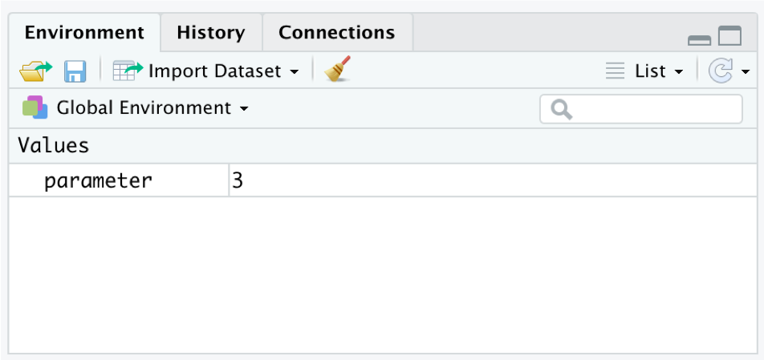
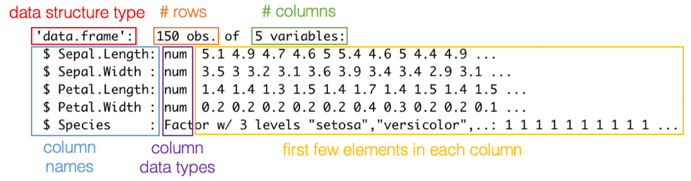
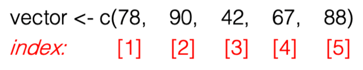
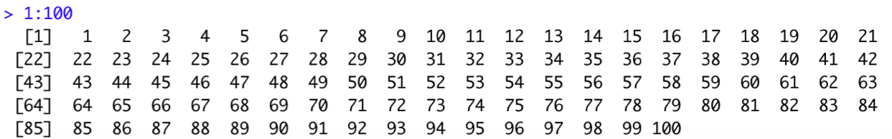
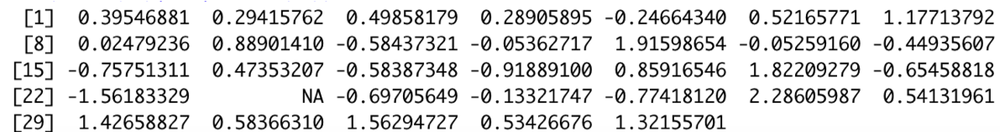

Module 3: Working with Data in R
================
Natalie Nelson, PhD

### 1\. Overview and learning objectives

Welcome to Module 3\! In this module, you will work towards building a
foundation in the basics of R coding. This module’s learning objectives
are to:

  - Define and understand how the following are used in R: function,
    arguments, syntax, atomic vector, data frame, tibble, matrix, NA,
    missing values

  - Setup and organize a R script

  - Create, inspect, and modify atomic vectors, data frames, and tibbles

  - Describe the different data types in R, as well as the coercion
    hierarchy

  - Subset a vector or data frame based on row and column index values

  - Perform conditional subsetting using logical operators

  - Read and write comma separated value files from R

  - Apply recommended coding syntax in your scripts

Instead of watching video lectures this week, you will work through this
tutorial and code directly in R. The tutorial includes “code snippets”
to serve as examples of the content. The code snippets are in grey
boxes. I have not included the output corresponding to the code snippets
because I want you to work through these examples in your own script.
Note that it should be straightforward to copy code snippet lines from
this tutorial and paste them in a R script. You are welcome to copy and
paste, but make sure that you are really thinking about the examples, as
the quiz will ask you questions related to the content presented here.

As you create code to follow along with the examples, I encourage you to
write and save the code in a script (that is, a .R file - remember, code
you enter in the Console will not be saved). This way, you’ll be
creating notes as you go, and you’ll have code you can re-use in the
future\! To create a script, navigate to the menu: `File` \> `New File`
\> `R Script`. Let’s get started\!

### 2\. Keeping your code organized

#### 2.1. Comments: `#`

When you create R scripts, the program will read each line as an
individual task. When you hit enter/return at the end of a line, R moves
on to the next line, expecting to receive a new instruction. To create a
line(s) in your code that R ignores - which is to say, does not
interpret as a task to execute - you should start the line with a `#`.
When R encounters a `#`, it ignores all subsequent text on that line.
Lines of code that start with a `#` are referred to as **comments**. The
`#` can occur at the start of a line, or after a bit of code. R reads
left-to-right just as we do in English, and it will start ignoring all
text that falls to the right of a `#`. It doesn’t matter if you have one
`#` or one hundred. In fact, many people use multiple `#` in a row to
create eye-catching sections in their code.

``` r
# Look ma, I'm commenting! 

#######################
## Here lies my code ##
#######################

1800 + 87 # The year in which NC State was established
```

Note that, once you type a comment, RStudio will display the text in
green. RStudio’s color coding is very handy and also useful for
troubleshooting issues.

A `#` signals the start of a comment, but where does the comment *end*?
Said another way, where is the end of the line? The end of the comment
(or, line) occurs wherever you hit enter/return; the end does not occur
as a function of the length of that line. If you are typing out a long
comment and would like the line to wrap on your screen, you can change
your options in RStudio: `Tools` \> `Global Options` \> `Code` \> check
`Soft-wrap R source files`.

You can also check to see how R is interpreting individual lines of code
based on the *code line numbers*. The line numbers are in the grey
margin of the source editor to the left of the code. The numbers serve
as line identification numbers. If you have a single line of code that
occupies multiple lines on your script (that is, you have soft-wrapping
enabled in RStudio), the line number will only occur next to the first
line in the wrapped code. The next line number won’t populate until you
hit enter/return. Go ahead and test this out.

You can also quickly comment and uncomment lines of code using the
**shortcut** `Ctrl+Shift+C` (Windows) or `Cmd+Shift+C` (Mac). The
shortcut for commenting/uncommenting will apply to the line of code your
cursor is on, or to a line(s) you have highlighted. Go ahead and give
this a
try.

#### 2.2. Script header: `rm(list = ls())`, `library()`, `install.packages()`

At the start of every script you create, you’ll want to include a few
lines of code to prepare your workspace. The script header should
include: (1) a description of the script, (2) code to clear your
workspace, and (3) code to load packages to your workspace.

**Description**: The description should include a few sentences
summarizing the content/functionality of the code, the code author, and
the
date.

``` r
### Description: R code accompanying Module 3 in BAE 495/590. Includes examples of code used to construct and inspect simple data structures in R.
### Author: Natalie Nelson, PhD
### Date created: September 4, 2019
### Last updated: September 4, 2019
```

**Clear the workspace**: Clear your workspace (workspace = your R
session) by running `rm(list = ls())`. This is the coding equivalent of
clicking “All Clear” or “AC” on a calculator. By running this line of
code, you are erasing any saved information (e.g. variables) in your
workspace and ensuring your prior work does not interfere with current
work. In this case, `rm()` is a *function* and `list` is one of the
function *arguments*. More on functions and arguments in a bit.

``` r
# Clear your workspace
rm(list = ls())
```

**Load packages:** Lastly, you should load any packages you’ll need for
your analysis to your workspace. In the Module 2 video lectures, I
briefly described why we load packages. As a refresher, R packages are
bundled sets of code unified by a common theme. Each R package includes
code corresponding to each function, as well as a reference manual.
Some, not all, packages include vignettes and sample data. The only
package that comes pre-loaded is the `base` package. To use functions in
any other package, you first have to install the package to your
computer. To install a package, run
`install.packages("package-name-between-quotation-marks")`. You only
need to install a package to your computer once. However, R will not
automatically load the contents of a package to your workspace; you need
to tell R which packages you will need for an analysis. To preserve
memory space, R does not automatically load packages on startup. The
longer you work in R, the more packages you accumulate. If R were to
load all packages to your workspace, your memory would not have enough
space to run. Therefore, by selectively loading only the packages you
need, you are reducing the computational burden on your computer.

To load the package to your workspace, use the `library()` function. For
this assignment, you will only need to load the `tidyverse` package.

``` r
# Load packages
library(tidyverse)
```

Note that `tidyverse` is not in quotation marks here, but you did put
`tidyverse` in quotes when you first installed it (i.e.,
`install.packages("tidyverse")`). Each function has its own *syntax*, or
spelling/grammar requirements. Packages usually have consistent function
syntax, but, frustratingly, syntax varies between packages. Some of
these subtle syntax differences are difficult to remember. As a result,
it’s very common to frequently check the user manual to determine the
proper syntax to use for a specific function.

Also, packages will remain loaded to your workspace even after you run
`rm(list = ls())`. Packages only need to be loaded when you open a
*session*; unless you tell RStudio to restart a session (by going to
`Session` \> `Restart R` or `New Session`), you will likely only have to
load your packages when you first open RStudio.

#### 2.3. Code sections

To organize your code, you can divide your code into sections that can
expand and collapse. In the menu, navigate to `Code` \> `Insert
section...`. You will then be prompted to type a section label, and hit
OK. The section will be created in your script. The section label will
have several dashes on its right, e.g. `# Label -------`. There will
also be a small triangle pointing down \(\triangledown\) to the left of
your section label (in the grey left-hand margin, but to the right of
the line numbers). When the triangle is pointed down, this indicates
that the section is expanded. You can collapse and expand the section by
clicking on the triangle. When the section is collapsed, the triangle
will point to the right, \(\triangleright\). An easier way to create a
section is to simply type `#`, your section label, and at least four
dashes `----`. Once you type the fourth dash, you will see a triangle
automatically pop up on the lefthand side of your code.

``` r
# Section label ----
```

### 3\. Objects

#### 3.1. Defining a simple object: `<-`, `print()`, `View()`

When you run a simple arithmetic operation in a script or directly in
the console, the output displays in the console. If you wanted to save
this output to manipulate it later - say, as a parameter in an equation
- you would need to assign the output in the console to a variable,
which is referred to as an *object* in R. In R, *object* and *variable*
are interchangeable terms, but this is not true in most programming
languages; for more, see the [“Objects”
section](https://cran.r-project.org/doc/manuals/r-release/R-lang.html#Objects)
of the R Language Definition documentation.

To create an object in R, we use `<-`, which is essentially an arrow.
For example, `parameter <- 3` would assign a value of 3 to an object
named `parameter`. Note that this is also evident from the direction of
the arrow: you are assigning 3 *to* the parameter. The arrow `<-` can
also be translated as “gets”, so we would read `parameter <- 3` as
“parameter gets 3”.

If you run `parameter <- 3`, you will not see any output in your
console. You will only see from the console that the code ran
successfully, which you will know because `> parameter <- 3` will be in
the console followed by `>` on the next line. To see the contents of
`parameter`, you can either type “parameter” directly in your script and
run `parameter`, or you can type `parameter` in the console. A second
option is to run `print(parameter)`; here, you are instructing R to
print (or, show) the contents of `parameter` in the console. A third
option is to enter `View(parameter)`. `View()` will open the contents of
`parameter` in a new tab in the source editor. Go ahead and try all
three options.

``` r
parameter <- 3
parameter # Run the name of the object to see its contents
print(parameter) # Alternatively, you can run print(name-of-object) to see the contents of the object
View(parameter) # View(name-of-object) will open the contents of the object in a new tab on your script editor
```

#### 3.2. Objects in the Environment tab

Importantly, you can now also see `parameter` in the `Environment` tab
in the upper-right pane on RStudio (Figure 1).

<center>



</center>

The `Environment` tab will display all objects defined in your session,
and show you some of the contents of the object (in this case, all of
the contents are shown because `parameter` only contains one number, 3).
When you clear your workspace, `rm(list = ls())`, all objects in
`Environment` will disappear because you have erased all objects from
your session. To observe how this occurs, go back to your code header
and run `rm(list = ls())`.

#### 3.3. Manipulating simple objects

Objects are useful because they can be manipulated. For example,
arithmetic operations can be applied to objects. Let’s define an object
with a single temperature observation in degrees Fahrenheit.

``` r
temp_F <- 90
```

We can then convert this temperature to degrees Celsius. The temperature
in Celsius can be defined as a new object, `temp_C`.

``` r
temp_C <- (temp_F - 32) * 5 / 9
temp_C # Here, we are running "temp_C" to see the contents of the temp_C object
```

Importantly, you can also *redefine* an object, which means that you are
assigning a *new* value to an *existing* object. The order in which you
run code matters; you should always sequentially run lines of code based
on the order of the operations needed for your analysis. When you run
the code below (all three lines), you define temp\_F three times: first
as 70 degrees F, then as 60 degrees F, and last as -5 degrees F.

``` r
temp_F <- 70
temp_F <- temp_F - 10
temp_F <- temp_F - 65
```

Note that you need to assign a value to an object using `<-`. If you run
`temp_F + 10` without assigning the output to an object, the output will
**not be saved**. The output will only print to your console. To save
the output of an arithmetic operation to an object, use `<-` to either
assign the output to the original object name (this would be described
as *redefining* the object), or assign the output to a new
object.

``` r
temp_F + 10                 # The output of this code will print to your console, but it will not be saved. 
temp_F_add10 <- temp_F + 10 # Now, we are assigning the output of temp_F plus 10 to a new object named temp_F_add10
temp_F_add10
temp_F                      # temp_F remains the same, -5
```

For those of you who have coded in other programming languages, you
might find it strange that we can create a new object simply by typing
out a name (for example, above, we created a new object, `temp_F_add10`
simply by typing “temp\_F\_add10” and assigning value to it). In some
other languages, objects first need to be defined, and values can only
be assigned to pre-defined objects. This is not the case in R. Although
you can pre-define an object if you so desire (we will review this in a
future module), it is not necessary. New objects can be defined as you
go.

#### 3.4. A note on `<-` vs. `=`

Technically, you can use `=` instead of `<-` to assign a value to an
object (e.g., `parameter = 3` will produce the same outcome as
`parameter <- 3`), but it is *highly recommended* that you do not do use
`=` to assign value to an object. In R, `=` is used in a variety of
ways, particularly within R functions. As a result, you can
inadvertently create errors in your code if you use `=` since `=` has
several translations. In contrast, `<-` is *only* used to assign values
to objects. You will avoid problems in your code if you consistently use
`<-` for object assignments. If you find it clunky to write out `<-`,
you can use the **shortcut** `Alt+-`.

#### 3.5. Object naming convention

There are a few rules and “best practices” you should follow when naming
objects:

  - Object names can include letters, numbers, underscores ’\_‘, and
    periods’.’

  - Objects cannot start with a number. `2019_samples` could not be an
    object name, but `samples_2019` could be.

  - Object names are case-sensitive. An object named `samples` is
    distinct from `Samples`.

  - You should avoid giving objects the same names as commonly-used
    functions. You will learn more about functions in this exercise, and
    will become acquainted with common function names over the semester.
    Even without knowing function names yet, you can probably guess a
    few, such as `mean()`. There is a `mean()` function, so it would not
    be appropriate to name an object `mean`. If you name an object
    `mean`, you risk running into issues with R attempting to interpret
    `mean` as a function, not an object.

  - It is recommended that you use lowercase words separated by
    underscores when naming objects. This is referred to as
    “snake\_case”. For example, `SpeciesJuly` would be written as
    `species_july` in snake\_case. The use of snake\_case is recommended
    because it is easier to type, and the use of underscores helps with
    readability. Also, by only using lowercase letters, you avoid issues
    associated with inadvertently switching between upper/lowercase. For
    example, it would be quite easy to create an object named `Y` and
    later refer to it as `y` because you forgot that the object name was
    a capital Y, not a lowercase y. Such a mistake could create errors
    in your code that might be easy to overlook.

<!-- end list -->

``` r
y <- 7
print(Y) # Results in an error message: "Error in print(Y) : object 'Y' not found"
print(y)
```

  - Try to give your objects names that make some sense to you. You will
    be tempted to simply add a number to the end of an object name every
    time you modify it, but this will result in several similarly-named
    objects that are difficult to track.

  - For your own sake, try to keep object names short. Although a longer
    name may be more descriptive and easier to interpret,
    `you_will_want_to_throw_your_computer_out_the_window_every_time_you_call_the_object_in_R`
    and your code will be difficult to read due to the long names
    occupying lots of space in your scripts. It’s admittedly not easy to
    maintain the interpretability of object names while minimizing
    length, so just try to strike a balance that works for you.

### 4\. Functions

#### 4.1. Applying functions in R

Functions are defined, easy-to-call codes that apply a set of commands
to values or objects in R. A function is always written as a word (i.e.,
the function name) followed by parentheses (with no space between the
function name and the parentheses), e.g. `function()`. In the
parentheses, the function arguments are listed. *Arguments* are the
inputs to a function; inputs include, at a minimum, values/objects that
the function should be applied to, as well as any additional parameters
that need to be specified in order to use the function. When the
function requires more than one argument, the arguments are separated by
commas, e.g. `function(arg1, arg2, arg3)`.

To demonstrate how functions are applied, let’s work with the `round()`
function. Before applying the function, first look at the help
documentation. This can be done by searching “round” in the search bar
of the `Help` tab in the bottom-right pane on RStudio. In the help
documentation, we can see that `round()` is a function used for
“Rounding of Numbers”, and there are also alternative formulations of
`round()`, including `ceiling()`, `floor()`, and `trunc()`. If you
scroll down to the `Arguments` section, you will see which arguments
need to be specified: `x` and `digits`. The `Arguments` description
highlights how `x` should be a numeric vector. We will learn more about
vectors in the next section of this tutorial. For now, know that you can
insert a single numeric value for `x`. In the `Usage` section of the
help documentation, we see how the arguments should be specified in the
function. The `Details` section provides additional information on how
the function is applied. At the bottom, the `Examples` section presents
samples of how the function can be applied. Honestly, the examples in
the help documentation are hit-or-miss, which is why it’s so valuable
when a package comes with a vignette.

Run the following code snippet to explore how the `round()` function
works.

``` r
round(7.777, digits = 1)
round(7.777, digits = 0)
# We can also define an object, and apply round to the object:
z <- 10.08509472
round(z, digits = 3)
# The output of round() can be assigned to a new object
z_rounded <- round(z, digits = 3)
z_rounded
```

Let’s also try out `ceiling()` and `floor()`. Note that, for these
functions, the help documentation `round()` is not particularly easy to
understand, but we can see from the `Usage` section that they only
require the `x` argument, and not `digits`:

``` r
k <- 3.56789
ceiling(k) # rounds up to the next-highest integer
floor(k)   # rounds down to the next-lowest integer
```

Let’s work with another function that is commonly used to transform
biological data: `log()`, which is used to compute logarithms. Pull up
the help documentation for `log()`. Note that `log()` calculates the
natural logarithm, whereas `log10()` calculates the base-10 logarithm.
This is a common point of confusion, since many people associate “ln”
with the natural log, which underscores the importance of always
checking the help documentation\! Under `Arguments`, you will see that
the description of the `base` argument also describes the *default* for
the argument. When an argument has a default, you do not have to specify
the argument when you apply the function *as long as* you are okay with
the default options.

``` r
# Calculate the natural log of 1
log(1)
# Assign the log-10 of x to y, where x has a value of 400
x <- 400
y <- log10(x)
y
```

#### 4.2. A note on the use of spaces

At this point, you may have noticed that the sample code provided in
this tutorial consistently uses spaces before and after `<-` and `=`,
after commas, and between operators such as `+` and `*`. Spaces help to
ensure your code is readable and organized. Hadley Wickham, Cheif
Scientist at RStudio, is known for saying “Good coding style is like
using correct punctuation. You can manage without it,
butitsuremakesthingseasiertoread.” For more details on coding style,
refer to Hadley’s [Style Guide](http://adv-r.had.co.nz/Style.html).

### 5\. Vectors

In section 3, we worked with objects that contained only one value.
There are times when single-value objects are useful, but it is more
common to work with multi-value objects, or *vectors*. A *vector* is a
one-dimensional series of values. In R, there are two kinds of vectors:
(1) atomic vectors, and (2) lists. Atomic vectors are *homogeneous*,
meaning atomic vectors can only contain values of one *type*. There are
six atomic vector types: (1) logical, (2) integer, (3) double, (4)
character, (5) complex, and (6) raw. Atomic vectors of type integer and
double are also referred to as being *numeric*. In contrast, lists are
*heterogeneous* vectors, meaning lists can include several atomic
vectors of different types. In this class, we will rarely work with
lists, but frequently construct and use vectors. Note that many
functions accept vectors as arguments (i.e., inputs) and produce vectors
as outputs.

#### 5.1. Data types

  - `logical` or `logi`: Logical data consist of `TRUE`, `FALSE`, and/or
    `NA` values. Logical data are typically used for applying conditions
    or comparisons.

  - `integer` or `int`: Integer data consist of integers, e.g. 1, 2, 3,
    and `NA`. Integer data are also a “numeric” type. To ensure that R
    interprets a value as an integer, the value should be immediately
    followed by `L`, e.g. `1`, `2`, `3` would be written as `1L`, `2L`,
    `3L`. Without using the `L` notation, R might correctly identify an
    integer, but R is more likely to assume the value is of type double;
    this is a more conservative assumption, as floating-point numbers
    are compatible with a wider range of functions in R than integers.

  - `double` or `dbl`: Double data consist of floating-point numbers,
    e.g. 1.2, 2.0, 3.444, as well as four special values for missing or
    infinite values, `NA`, `NaN`, `Inf`, and `-Inf`. Integer data are
    also a “numeric” type.

  - `character` or `chr`: Character data consist of text. The text can
    include single characters or multiple words, e.g. `"s"`,
    `"seashells"`, `"she sells seashells"`, as well as `NA`.

  - `complex` and `raw`: Complex data refer to complex numbers with real
    and imaginary parts, and raw data refer to bitstreams. These data
    types are rarely used in environmental and agricultural data
    analyses and, thus, will not be covered in this course.

#### 5.2. Creating an atomic vector: `c()`

The easiest way to construct an atomic vector is with the `c()`
function. Here, `c` stands for “combine”. Arguments provided to `c()`
will be combined into a vector. As described above, vectors are
homogeneous, meaning that the data type in a single vector needs to be
consistent.

``` r
# Integer vectors - to specify that a value is an integer, it should be followed by L:
cotton_yield_int <- c(925L, 970L, 983L, 940L, 959L, 933L)
julian_day <- c(20L, 36L, 60L, 82L, 87L, 121L, 150L, 202L, 261L, 289L, 310L, 344L, 360L)
# Double vectors:
cotton_yield_dbl <- c(925, 970, 983, 940, 959, 933)
dissolved_oxygen <- c(8.3, 7.88, 6.21, 6.0, 6.57, 6.89, 7.3, 7.4, 8.21, 9.1)
water_temp <- c(30.0, 31.3, 29.02, 30.667, 27.90)
# Character vectors:
field_ids <- c("field_1", "field_2", "field_3", "field_4", "field_5", "field_6")
dna_bases <- c("ACCG", "GCAT", "TAGG")
```

Above, note that character values **must be** typed between quotation
marks, otherwise R will interpret the text as an object name. The
quotation marks instruct R to interpret the text between the quotes as
character data. This is important because objects can be included in
vectors; when a vector object is included as an argument in `c()`, the
vector will be included in the new vector being constructed.

``` r
# dna_bases at the beginning of a new vector, dna_bases_expanded:
dna_bases_expanded <- c(dna_bases, "AGCT", "ACCG", "TGGA")
dna_bases_expanded
dna_bases
# water_temp inserted in the center of a new vector, water_temp_expanded:
water_temp_expanded <- c(16.3, 16.1, water_temp, 16.9, 16.67)
water_temp_expanded
water_temp
```

You may have noticed that I did not provide an example of a logical
vector above. Logical vectors are usually produced as *output* when
applying functions or conditional statements, and typically are not
constructed with `c()`. Logical vectors are discussed in more detail
starting in section
8.2.

#### 5.3. Creating atomic numeric vectors with sequential or repeated values: `:`, `seq()`, `rep()`

For many analyses, it is often useful to make use of numeric vectors
with sequential or repeated values. To construct an integer vector with
sequential values spaced by 1, the `:` symbol can be used. Note that,
when `:` is used in this way, the values are automatically assumed to be
integers even without `L` being listed. However, if you prefer, you can
use `L` for the sake of consistency.

``` r
# Create a vector of 1-to-10
one_to_ten <- 1:10
one_to_ten
# Create a vector of 1-to-10 using the L notation
1L:10L 
# If the numbers are flipped, the vector will reverse direction
10:1
# The : symbol can also be used to string together several sequential vectors using c()
c(1:5, 10:15, 100:105)
```

If you want to create a sequential vector that has spacing other than 1,
the `seq()` function is used. `seq` stands for “sequence”. Go ahead and
search `seq()` in the help documentation. The `seq()` function accepts
several arguments, but the three that you should modify are `from`,
`to`, and `by`. For example, if we run `seq(from = 0, to = 5, by
= 0.5)`, the line of code would be translated as: create a `seq` vector
`from` 0, `to` 5, spaced `by` an increment of 0.5. Note that, whereas
`:` creates integer vectors, `seq()` creates vectors of type double.

``` r
# 0 to 5 by 0.5
seq(from = 0, to = 5, by = 0.5)
# 0 to 1 by 0.1
seq(from = 0, to = 1, by = 0.1)
# 0 to 20 by 2
seq(from = 0, to = 20, by = 2)
# 10 to 100 by 10
ten_by_ten <- seq(from = 10, to = 100, by = 10)
ten_by_ten
```

Lastly, `rep` is used to create a vector with repeated values. `rep`
stands for “replicate”. Go ahead and search for `rep()` in the help
documentation. The `rep()` function accepts several arguments, but the
main ones to focus on are `x`, `times`, and `each`. `x` is a value or
atomic vector that should be repeated, `times` specifies the number of
times the value/vector should be repeated, and `each` specifies how many
times each element in a vector should be repeated (note that `each` is
only specified when repeating a vector).

``` r
# Repeat a value of 2, 5 times
rep(2, times = 5)
# Repeat a vector of 1:3, 3 times
rep(1:3, times = 3)
# Repeat a vector of 1:3, 3 times, with each value repeated 2 times
rep(1:3, times = 3, each = 2)
# Repeat the ten_by_ten vector, 2 times
rep(ten_by_ten, times = 2)
# Repeat the ten_by_ten vector, 1 time, with each value repeated 3 times
ten_by_ten_3x <- rep(ten_by_ten, times = 1, each = 3)
ten_by_ten_3x
# Create the "tubthumping" chorus
rep(c("I get knocked down", "but I get up again", "you're never gonna keep me down"), times = 4)
```

#### 5.4. Inspecting vectors: `length()`, `typeof()`, `class()`, `str()`, `head()`, `tail()`

When working with vectors, it’s important to evaluate certain vector
characteristics, particularly the vector *length* and *type*.

**Length**: The length of a vector refers to the total number of entries
in the vector. For example, the `cotton_yield_int` vector we constructed
above includes 6 cotton yield observations as integers. Instead of
visually counting the number of entries in the vector, R can provide you
with the total number of values in the vector using the `length()`
function. Note that `length()` can only be used with one-dimensional
vectors.

``` r
# Length of cotton_yield_int
length(cotton_yield_int)
# Length of ten_by_ten_3x
length(ten_by_ten_3x)
# Length of dna_bases
length(dna_bases)
# Length of dna_bases_expanded
length(dna_bases_expanded)
```

**Type**: There are several ways to determine what type of data are
included in a vector. The first is using `typeof()`.

``` r
typeof(cotton_yield_int)
typeof(cotton_yield_dbl)
typeof(field_ids)
```

The second option is to use `class()`.

``` r
class(julian_day)
class(dissolved_oxygen)
```

Note that, for vectors of type double, the output of `class` is
`numeric`, not `double`. Double vectors are also numeric vectors, but
the same could be said for integer - so why does `class()` specify that
vectors of type double are `numeric` and vectors of type integer are
`integer`? I wish I knew. I acknowledge that imprecision in the use of
`numeric`, `double`, and `integer` is potentially confusing. The main
point to remember is that `typeof()` is the most precise function for
inspect vector type, that `numeric` and `double` are often used
interchangeably in R, and that `numeric` and `integer` are usually not
used interchangeably in R despite integer data also being numeric.

The last function that can be used to inspect vector type is `str()`,
where `str` stands for “structure”. `str` provides more information than
`typeof()` and `class()`. From left to right, the output of `str()`
displays:

  - An abbreviated description of the vector type in the same format as
    `class()` (`int` for integer, `num` for double, `chr` for character,
    and `logi` for logical)

  - The length as `[1:length]`, where `length` is the actual length of
    the vector

  - A preview of the first few entries in the vector. The number of
    entries shown varies.

<!-- end list -->

``` r
str(julian_day)
str(dissolved_oxygen)
str(field_ids)
```

**Head and tail**: When working with a long vector, you might want to
inspect its contents (particularly if you’ve been modifying the vector
in some way). If you print a long vector to your console, it might be
too cumbersome to look at, or the console might cut it off (the console
has a max printing length). When this occurs, you can use `View()` to
open up the vector in a new tab and inspect it. Sometimes, though, you
really only need to look at the top and bottom of the vector to confirm
that a certain operation has applied in the way you expected. To look at
the top of a vector, use the `head()` function. To look at the bottom of
a vector, use the `tail()` function. By default, `head()` and `tail()`
will print the 6 first and last entries, respectively. If you want to
inspect more than 6 entries, you can use the `n` argument (see the help
documentation) to specify the number of vector elements that should
print to the console.

``` r
long_vector <- 1:100
head(long_vector)
head(long_vector, 10)
tail(long_vector)
tail(long_vector, 20)
```

#### 5.5. Coercion: `as.numeric(x)`, `as.integer(x)`, `as.character(x)`, `as.logical(x)`

Earlier, we discussed how atomic vectors can only include one data type
(e.g. only `chr`, only `int`, only `num`, etc.). If you create a vector
that has multiple types, such as `c(20, 30.1, "potato")`, R will coerce
the data in the vector to become homogeneous. There is a hierarchy to
this coercion process:

  - If R encounters a vector with numeric and character data, the vector
    will be coerced to character.

  - If R encounters a vector with logical and numeric data, the vector
    will be coerced to numeric (`TRUE` will be converted to `1` and
    `FALSE` will be converted to `0`).

  - If R encounters a vector with logical and character data, the vector
    will be coerced to character (`TRUE` will be converted to `"TRUE"`,
    and `FALSE` will be converted to `"FALSE"`).

  - If R encounters a vector with logical, numeric, and character data,
    the vector will be coerced to character.

<!-- end list -->

``` r
# Numeric data mixed with character
numeric_and_character <- c("you're", "about", 0.5, "way", "through")
numeric_and_character # 0.5 was coerced into a character value, which we can tell because 0.5 is now in quotes, "0.5"
typeof(numeric_and_character)

numeric_as_character <- c(2.1, "300", "6", 77.7, 0) # Note that numbers in quotations are interpreted as characters
numeric_as_character # 2.1, 77.7, and 0 were coerced into characters
typeof(numeric_as_character)

# Numeric data mixed with logical
numeric_and_logical <- c(TRUE, 100, FALSE, 200)
numeric_and_logical # TRUE and FALSE were coerced into 1 and 0
typeof(numeric_and_logical)
```

For a range of reasons, when reading data into R (i.e. not creating a
vector manually with `c()`), it is not uncommon for R to interpret
numeric data as character data. This will sometimes occur if a single
value in a vector includes a character by mistake. For example, it’s
conceivable that you could load a spreadsheet into R that contains a
single vector of air temperature observations. The vector may be
`(90, 91, 95, 96F, 92)`, where the person entering the data accidently
typed `F` with `96`. Because R sees a character in the vector, it will
coerce the vector into character: `("90", "91", "95", "96F", "92")`.
When this happens, you will need to remove the “F” from original data in
order for R to interpret the data as numeric. R will not never be able
to interpret `(90, 91, 95, 96F, 92)` as a numeric vector as long as a
character is in there.

Though R will sometimes interpret numeric data as character data due to
the insertion of a character, sometimes R will simply incorrectly
interpret numeric data as character. When this happens, we need to use
one of the `as.___()` functions to *convert* or *coerce* the vector into
the type we want. The most commonly-used `as` functions are as follows:

  - `as.numeric(x)`: converts vector `x` to numeric (i.e., double)

  - `as.integer(x)`: converts vector `x` to integer

  - `as.character(x)`: converts vector `x` to character

  - `as.logical(x)`: converts vector `x` to logical

<!-- end list -->

``` r
# Numeric data read as character: convert to numeric
as.numeric(numeric_as_character)
typeof(as.numeric(numeric_as_character))

# Logical data read as numeric: convert to character
as.character(numeric_and_logical) # Note that, since R has already coerced the TRUE and FALSE to 1 and 0, this conversion to character maintains the 1 and 0
typeof(as.character(numeric_and_logical))
```

#### 5.6. Who cares whether R reads a vector as character, numeric, or logical?

Functions in R are only compatible with certian vector types. In
particular, mathematical functions cannot be applied to character
vectors (you can’t multiply and divide characters\!). This is why it’s
particularly problematic if R interprets a numeric vector as a character
vector - essentially no arithmetic functions will be compatible with the
vector, leaving you unable to analyze the data contained in the vector.

### 6\. Vectors and functions

#### 6.1. Arithmetic operations

As discussed in Module 2, R’s most basic functionality is as a
calculator. Arithmetic operators are exactly the same as those on your
computer’s calculator: `+`, `-`, `/`, `*`, `^`, `()`, etc. You can also
apply these operations to vectors. When you apply an operation to a
vector, it will apply to each element in the vector. Note that *element*
and *value* are synonymous. However, you can use arithmetic operations
to manipulate/modify a vector based on another vector(s). When you apply
arithmetic operations to vectors, the operations will be applied
*element-wise*, meaning element-by-element. For example, if you
multiplied a vector `x <- c(1, 2, 3)` by another vector `y <-
c(0, 1, 2)`, the first element of x, `1`, would be multipled by the
first element of y, `0`; the second element of x, `2`, would be
multiplied by the second element of y, `1`, etc.

``` r
x <- c(1, 2, 3)
y <- c(0, 1, 2)
z <- 1:10

# Multiply x by 2
x * 2

# Square each element in y
y ^ 2

# Multiply x by y
x * y

# Square the product of 3 and the natural log ofx
(3 * log(x)) ^ 2 # Note that the parantheses are applied to indicate order of operations

# Add y and z
y + z
```

Note that you received a warning stating `Warning in y + z: longer
object length is not a multiple of shorter object length`. This warning
occurred because `y` has a length of 3, whereas `z` has a length of 10.
When you apply arithmetic to vectors of different length, the shorter
vector will be repeated to a length of the longer vector. For example,
`y` has values of `(0, 1, 2)`, and `z` has values of
`(1, 2, 3, 4, 5, 6, 7, 8, 9, 10)`. To perform `y + z`, R will repeat `y`
until it is of length `z`: `(0, 1, 2, 0, 1, 2, 0, 1, 2, 0)`. This
repeated vector will then be added to `z`:
`(1, 3, 5, 4, 6, 8, 7, 9, 11, 10)`. If we only wanted to add `y` to the
first 3 elements of `z`, we could create a new vector `y_extended` that
has the same length as `z`, but with `0` in the 4th to 10th elements of
the vector (there are many ways we could address this issue, and the
code snippe below offers just one potential solution).

``` r
y_extended <- c(y, rep(0, times = 7))
y_extended
length(y_extended)
y_extended + z
```

#### 6.2. Applying functions to vectors

Many functions are designed for use with vectors. As simple examples, we
can use `sum()` to calculate the sum of all elements in a vector and
`mean()` to calculate the vector average. We can also use `cumsum()` to
create a vector that cumulatively sums the elements in a vector.

``` r
sum(z)     # Sum all elements in vector z
sum(z, x)  # Sum all elements in vectors z and x
mean(z)    # Calculate the mean of elements in vector z
cumsum(x)  # Calculate the cumulative sum of elements in vector x
```

As an additional example, let’s run a two-sample t-test using the
`t.test()` function. The arguments of this function allow you to specify
`alternative` to indicate whether the alternative hypothesis is
`"greater"`, `"less"`, or `"two.sided"`, and `paired` to specify whether
the t-test is paired, as well as other arguments. See the help
documentation for more details, if you’re
interested.

``` r
observations_field1 <- c(55.5, 60.2, 70.1, 56.8, 90.2, 50.5, 52.4, 62.3, 55.3, 61.4, 57.9, 53.1)
observations_field2 <- observations_field1 * 0.1
t.test(observations_field1, observations_field2, alternative = "two.sided", paired = TRUE)
```

### 7\. Data frames and tibbles

#### 7.1. Data frames

In R, there are several types of *data structures*. A vector is a
one-dimensional data structure. A data frame is a two-dimensional data
structure that consists of a table composed of equally-sized vectors
(Figure 2). In a data frame, each column is a vector, and the same rules
that apply to vectors also apply to columns in a data frame - that is,
each column has a single data type. In Figure 2, the sample data frame
consists of three columns: a numeric vector, a character vector, and a
logical vector. Note that data frames *are not* equivalent to matrices.
In R, a matrix is totally distinct from a data frame. A matrix is
essentially a multi-dimensional atomic vector: all values (i.e. all
columns) in a matrix must be of the same data type.

<center>


</center>

When you read data into R, the data will usually be read as a data frame
object. Datasets are rarely composed of a single data type. Usually, an
environmental or agricultural dataset will have a column dedicated to
different variables such as measurements, date and time of measurement,
location of measurement, etc. Therefore, data frame objects are
well-suited to contain datasets.

#### 7.2. Sample data frame: `iris`

`base` R comes pre-loaded with a few datasets, such as `iris`. The
`iris` dataset includes measurements of sepal length, sepal width, petal
length, and petal width for 150 iris plants that are one of three
species: *Iris setosa*, *Iris versicolour*, and *Iris virginica* (Figure
3). More details on the `iris` dataset can be found at the [UCI Machine
Learning Repository](http://archive.ics.uci.edu/ml/datasets/iris). To
load the iris dataset, run `data(iris)`. `data()` is a function used to
call datasets available in R packages (including `base` R).

<center>


</center>

``` r
data(iris)
```

The data are now available as an object named `iris`. You can see `iris`
is now an object in your `Environment` tab under
`Data`.

#### 7.3. Inspecting data frames: `colnames()`, `rownames()`, `head()`, `tail()`, `View()`, `nrow()`, `ncol()`, `dim()`, `summary()`, `str()`

Several functions are available for inspecting the contents and
structure of data frames. Some commonly-used functions for inspecting
data frame objects include:

**Names**:

  - `colnames(x)`: Retrieves the column names of a data frame `x`. All
    data frames have column names, and the use of column names helps to
    simplify data management and analysis in R.

  - `rownames(x)`: Retrieves the row names of a data frame `x`. Row
    names are often numbers in sequential order from 1 to the length of
    the vectors in the data frame.

**Content**:

  - `head(x)`: Displays the column names and the top six rows of the
    data frame in the console. You can specify the number of rows you
    want displayed using `head(x, #)`, where `#` is the number of rows
    you would like displayed in the console. You always have the option
    of displaying your entire data frame in the console by simply
    printing your data frame (`x`), but data frames are often too large
    to visually inspect in the console, which is why `head()` is handy.

  - `tail(x)`: Displays the column names and the bottom six rows of the
    data frame in the console. The syntax for `head()` is the same as
    `tail()`.

  - `View(x)`: Opens a new tab in your source editor with the contents
    of the entire data frame.

**Dimensions**:

  - `nrow(x)`: Returns the number of rows in the data frame.

  - `ncol(x)`: Returns the number of columns in the data frame.

  - `dim(x)`: Returns two values: the first is the number of rows (same
    number produced by `nrow()`), and the second is the number of
    columns (same number produced by `ncol()`). `dim` stands for
    “dimension”.

**Summary**:

  - `summary(x)`: Provides summary statistics of each column. For values
    that are numeric, the summary statistics will include values for the
    minimum `Min.`, 1st quartile (i.e. 25th percentile) `1st Qu.`,
    median `Median`, mean `Mean`, 3rd quartile (i.e. 75th percentile)
    `3rd Qu.`, and maximum `Max.`.

  - `str(x)`: This is the same function that we applied to look at the
    contents of vectors. When applied to a data frame object, the
    `str()` output will provide you with more detail on the contents of
    the object. Annotations of the `str()` output as applied to data
    frames are shown in Figure 4; note that Figure 4 is displaying the
    output of `str(iris)`. One of the columns, `Species` is of type
    `Factor`. We’ll discuss factors more in the next module. For now,
    you can consider `factor` and `character` to be interchangeable (to
    be clear, a `factor` is distinct from a `character` vector - but the
    assumption that the two are synonymous works for now).

<center>



</center>

On your own, go ahead and run each of these inspection functions on the
`iris` object.

#### 7.4. Creating data frames: `data.frame()`

To create a data frame, the `data.frame()` function is used. Arguments
to `data.frame()` include column names and the vectors that are
contained in each of the columns. The syntax is `data.frame(name1 =
vector_object, ...)`, where `name` is the column name you have chosen
and `vector_object` is the vector that includes the contents of a
column. Remember that *all* columns in a data frame must have the same
length. As an example to start with, we’ll create a data frame of [named
hurricanes in the 20th century that either made landfall in NC or
brought Category 3-level winds to
NC](https://en.wikipedia.org/wiki/List_of_North_Carolina_hurricanes#North_Carolina_major_hurricanes).

``` r
# Option 1: create vector objects before constructing a data.frame
names <- c("Great Atlantic Hurricane",
           "Hazel",
           "Connie",
           "Ione",
           "Helene",
           "Donna",
           "Diana",
           "Emily",
           "Fran")
# Note this coding style! Whenever you enter a comma to separate function arguments, you can hit enter/return to put the subsequent argument on a new line. RStudio will automatically indent. Although using this style results in your code taking up more space, it is often much easier to find small errors with this style since the text isn't crammed together.

cat <- c(3, 4, 3, 3, 3, 3, 3, 3, 3)

month <- c("Sep", "Oct", "Aug", "Sep", 
           "Sep", "Sep", "Sep", "Aug", "Sep")
# Note You can hit enter/return after any comma

year <- c(1944, 1954, 1955, 1955, 1958, 1960, 1984, 1993, 1996)

data.frame(hurricane = names, 
           category = cat,
           landfall_month = month, 
           landfall_year = year) 
# Note that snake_case is also recommended for column headers!

# Option 2: define vectors in data.frame() directly
data.frame(hurricane = c("Great Atlantic Hurricane", "Hazel", "Connie", "Ione", "Helene", "Donna", "Diana", "Emily", "Fran"), 
           category = c(3, 4, 3, 3, 3, 3, 3, 3, 3),
           landfall_month = c("Sep", "Oct", "Aug", "Sep", "Sep", "Sep", "Sep", "Aug", "Sep"), 
           landfall_year = c(1944, 1954, 1955, 1955, 1958, 1960, 1984, 1993, 1996))
```

From the code above, we can see that Option 1 requires more work, but is
ultimately easier to read. I encourage you to always opt for any option
that makes your code easier to read. As beginners to R, you will make
your lives easier if you keep your code organized and readily
interpretable.

We applied the `data.frame()` function, but missed a key step: assigning
the data frame to an object. Remember, just because you see output in
the console doesn’t mean that you’ve saved the output to an object.
Assigning function output to an object always requires the use of `<-`.

``` r
nc_hurricanes <- data.frame(hurricane = names, 
                            category = cat,
                            landfall_month = month, 
                            landfall_year = year)
str(nc_hurricanes)
# Inspect nc_hurricanes using the functions described in section 7.4.
```

Note that the column names in `nc_hurricanes` are the ones that we
specified in the `data.frame()` function. From the `str(nc_hurricanes)`
output, we can see that our data frame has 9 rows and 4 columns.

#### 7.5. Tibbles

Tibbles are functionally equivalent to data frames, but have a few
additional features that make them a bit easier to work with. Tibbles
are described in detail in [Chapter 10 of
R4DS](https://r4ds.had.co.nz/tibbles.html). The key distinction between
a tibble and data frame is the way the tibble looks when you print it to
the console. To explore the differences between tibbles and data frames,
create a tibble from your `nc_hurricanes` data frame using the
`as_tibble()` function.

``` r
nc_hurricanes_tibble <- as_tibble(nc_hurricanes)
nc_hurricanes_tibble
```

When you print a tibble, you see the first several rows, and you also
see some of the information that the `str()` function usually provides.
Beneath each of the column names, you will find the data type associated
with the column in `< >`. For example, beneath `category`, `<dbl>` is
printed in grey italics. `<dbl>` indicates that the `category`
variable/column is a `double` vector. Additionally, you will see `# A
tibble: 9 x 4` printed at the top of the printed tibble in the console.
Here, `9` corresponds to the number of rows and `4` corresponds to the
number of columns in the tibble.

### 8\. Subsetting and conditional subsetting

#### 8.1. Subsetting vectors: `[ ]`

Often, you may want to pull only select elements out of a vector. To
select an element from a vector, brackets `[ ]` are used. The number
associated with the *index* of the element you’re interested in should
be placed between the brackets. An *index* is the position of an element
along the vector. In Figure 5, the index values are shown in red below
each element in the vector.

<center>



</center>

``` r
water_temp      # The entire vector
water_temp[2]   # The second element in the vector
water_temp[5]   # The fifth element in the vector
```

To select multiple elements from a vector, we can construct a vector
with `c()` including each of the index values corresponding to the
elements we’d like to select.

``` r
julian_day                     # The entire vector
julian_day[c(1, 3, 6, 7, 10)]  # The first, third, sixth, seventh, and tenth elements
```

We can also use function outputs to select specific elements in a
vector. For example, if we want to select the last element in a vector,
we can include `length(x)` between the brackets. Similarly, if we want
to select the element at the center of the vector, we could include
`ceiling(length(x) / 2)` or `floor(length(x) / 2)` between the brackets
depending on the length of the vector.

``` r
julian_day                                  # The entire vector
length(julian_day)                          # The length of the vector
julian_day[length(julian_day)]              # The last element of the vector
julian_day[ceiling(length(julian_day) / 2)] # The center element of the vector
l <- length(julian_day)                     # An object containing the length of the vector
julian_day[l]                               # The last element of the vector, selected using the length object, l
```

#### 8.2. Conditional subsetting of vectors: `<`, `>`, `<=`, `>=`, `==`, `!=`, `!`, `%in%`, `&`, `|`, `xor()`, `which()`

Conditional subsetting refers to subsetting a vector through the use of
a `logical` vector. As described in section 5.1., a logical vector
consists of `TRUE`, `FALSE`, and/or `NA`. For now, we will focus on
`TRUE` and `FALSE`. R reads `TRUE` and `FALSE` as special values, where
`TRUE` indicates an action should be performed, and `FALSE` indicates an
action should not be performed. We can use logical vectors to select, or
subset, elements in a
vector.

``` r
logical_example <- c(TRUE, TRUE, FALSE, TRUE, FALSE, FALSE) # The logical vector
# Note that TRUE and FALSE do not need to be written in quotes, and RStudio color codes TRUE and FALSE in blue.

field_ids                           # The entire vector
field_ids[logical_example]          # The first, second, and fourth elements of the vector

dna_bases_expanded                  # The entire vector
dna_bases_expanded[logical_example] # The first, second, and fourth elements of the vector
```

Here, we can see that only the elements that corresponded to index
values in `logical_example` with elements of `TRUE` were selected (the
first, second, and fourth elements).

Using logical vectors to subset a vector becomes more interesting when
we generate logical vectors using logical operations or functions. The
following operators are commonly-used when conditionally subsetting
(some are illustrated in Figure 6):

  - `<`, `>`: less than, greater than.

  - `<=`, `>=`: less than or equal to, greater than or equal to.

  - `==`: exactly equal to.

  - `!=`: not equal to.

  - `!x`: not in `x`, where `x` is a vector of values.

  - `%in% x`: in `x`, where `x` is a vector of values.

  - `&`: and. Used to instruct R to only apply a command if *all*
    conditional statements are satisfied.

  - `|`: or. Used to instruct R to apply a command if *at least one* of
    the conditional statements are satisfied.

  - `xor()`: exclusive or. Used to instruct R to apply a command if
    *only one* of the conditional statements are satisfied.

<center>


</center>

``` r
# Let's work with the vectors we created to include in the nc_hurricanes data frame. 

# Years in which major hurricanes hit NC in the 20th century: 
year
# In the 20th century, what were the years in which major hurricanes impacted NC prior to 1960?
year < 1960       # conditional statement producing a logical vector
year[year < 1960] # conditional subsetting
# How many major hurricanes impacted NC in the 1990s?
length(year[year > 1989])  # using greater than
length(year[year >= 1990]) # using greater than or equal to
# Which major hurricanes impacted NC in the 1950s?
year < 1960 & year > 1949        # conditional statement producing a logical vector
names[year < 1960 & year > 1949] # conditional subsetting
# In what year did the Great Atlantic Hurricane occur?
names == "Great Atlantic Hurricane"
year[names == "Great Atlantic Hurricane"]
# Which of the major hurricanes in the 20th century landed in September or October?
month %in% c("Sep", "Oct")        # option 1 using %in%
names[month %in% c("Sep", "Oct")]
month == "Sep" | month == "Oct"   # option 2 using |
names[month == "Sep" | month == "Oct"]
# Which of the major hurricanes in the 20th century did not land in September?
month != "Sep"
names[month != "Sep"]
# Which of the major hurricanes in the 20th century was not a category 3?
cat == 3
names[!cat == 3]
# Which of the major hurricanes in the 20th century either occurred after 1990 or was a category 4?
xor(year > 1990, cat == "4")
names[xor(year > 1990, cat == "4")]
```

The `<`, `>`, `<=`, and `>=` operators can also apply to characters, but
to check which character is higher in alphabetical order than the other.
Note that, the further down the alphabet a character/word is, the
“greater” its value. So, `"z"` is greater than `"a"`.

``` r
"q" < "t"
"a" > "b"
"four" > "five"
```

If, instead of a logical vector, you wish to see a vector with the index
numbers associated with the `TRUE` values in a conditional statement,
you can use the `which()` function. You can supply any conditional
statement to the `which()`
function.

``` r
# Which of the major hurricanes in the 20th century was not a category 3?
cat != 3               # Conditional statement that produces a logical vector
which(cat != 3)        # Conditional statement with which() = produces a numeric vector
names[which(cat != 3)]
not_cat_3 <- which(cat != 3) # The output of which() can be assign to a vector object
names[not_cat_3]
```

#### 8.3. Subsetting data frames (and tibbles\!): `[,]`, `$`

To subset a dataframe, we again use brackets `[ ]`. Because data frames
are two-dimensional (i.e., they have rows and columns), we now have to
specify two index values between the brackets: a row index, and a column
index. The row and column index values are always separated by a comma
between the brackets: `[row_index, column_index]`. The row index is
always written first, and the column index is always written second. The
syntax of specifying data frame dimensions as `row, column` is
consistent across all functions in R. **Importantly**, when you subset a
data frame, you must include a comma in the brackets. Without a comma, R
will think you are treating the data frame like a vector, and it will
throw an error message. However, you can leave either the row index or
column index blank. If you leave the column index blank, all columns
will be included in the subset. If you leave a row index blank, all rows
will be included in the
subset.

``` r
# Select the element in first row and third column of the iris data frame
iris[1, 3]
# Select the 10th row of iris
iris[10, ]
# Select the 3rd column of iris
iris[, 3]
# Select the 100th to 120th rows in iris
iris[100:120, ]
# Select the 50th, 55th, and 59th rows in iris
iris[c(50, 55, 59), ]
# Select the 10th and 100th rows in iris and the third through fifth columns
iris_2row_subset <- iris[c(10, 100), c(3:5)]
iris_2row_subset
```

You can also use negative values to *remove* columns or rows in the data
frame. This is also true for vectors.

``` r
# Select the 12th and 13th rows, and 2nd through 5th columns of iris
iris[c(12, 13), -1]
iris[-c(1:11, 14:nrow(iris)), c(2:5)]
```

Using index values works well, but one of the key advantages of working
with data frames is the ability to subset based on column names. There
are several ways to subset columns from a data frame using column names.
We will focus on two:

  - Use `$`: `df$my_column`. This notation will extract `my_column` from
    the data frame `df` and make it into a one-dimensional atomic
    vector.

  - Include the column name in quotation marks where you would write the
    column index: `df[ , "my_column"]`. Again, this notation will
    extract `my_column` from the data frame `df` and make it into an
    atomic vector. You can also list multiple column names in a vector
    created with `c()`, and place this vector to the right of the comma
    in the brackets: `df[, c("my_column", "my_other_column")]`. With
    this notation, the subset you create will be a data frame, not a
    vector (remember, vectors can only be
one-dimensional).

<!-- end list -->

``` r
# First, let's create a new object that only includes the first 5 rows of iris
iris_short <- iris[1:5, ]

# Subset iris_short such that you only keep the Sepal.Length column
iris_short$Sepal.Length            # using the $ notation
str(iris_short$Sepal.Length)       # vector

iris_short[ , "Sepal.Length"]      # using the bracket notation
str(iris_short[ , "Sepal.Length"]) # vector

# Subset iris_short such that you keep the Sepal.Length and Sepal.Width columns
iris_short[, c("Sepal.Length", "Sepal.Width")]      # using the bracket notation
str(iris_short[, c("Sepal.Length", "Sepal.Width")]) # data frame

# Create a vector of Petal.Length from iris
petal_length <- iris$Petal.Length

# What is petal length measurement in the 101th row of iris?
petal_length[101]
iris[101, "Petal.Length"]

# How many petal length measurements in iris were greater than 6?
petal_length[petal_length > 6]         # vector of measurements with Petal.Length > 6
length(petal_length[petal_length > 6]) # number of measurements

petal_length_grtr_6 <- iris[iris$Petal.Length > 6, "Petal.Length"] # Alternative approach
length(petal_length_grtr_6)
```

#### 8.4. Bracketed value in the console

You may have noticed that output in the console always starts with a
number in brackets, e.g. `[1]`. The number in brackets corresponds to
the index value of the first element listed on that line. For example,
if we run `1:100` in the console, the output should wrap across a few
lines. Exactly where the lines break will vary based on your display
size and RStudio window - you can experiment with this by adjusting the
width of your console pane, and re-running `1:100`.

Figure 7 shows what the output in my console looks like when I run
`1:100`. Because we created a sequential integer vector (`1:100`), the
values in the vector are conveniently equal to their index positions. We
can see that `[1]` is in the left margin of the first line of output, as
is always the case. `[22]` is in the left margin of the second line of
output, which means that the first value on the second line is in the
22nd position along the vector. `[64]` is in the left margin of the
fourth line, as the first element printed on the fourth line is at index
= 64.

<center>



</center>

These values can be helpful for quick visual inspection as you evaluate
your output. For example, in Figure 8, the output includes one `NA`.
Thanks to the index values shown to the side, I can quickly determine
that the `NA` is located at index = 23. Also through visual inspection,
I can see that the output has length of 33.

<center>



</center>

### 9\. Missing values

When an element in a vector or data frame is blank, we refer to the
blank element as a *missing value*. Missing values are denoted by `NA`,
and can also be denoted by `NaN` in vectors with data of type double.
`NA` stands for “Not Available”, and `NaN` stands for “Not a Number”.

#### 9.1 Ignoring missing values: `na.rm`

`NA` values interfere with several R functions. In many cases, a
function will not run if it encounters a `NA`, and the output it
produces will simply be `NA`. Most functions that cannot handle `NA`s
have an optional argument called `na.rm`, which stands for “NA remove”.
This argument is set to `TRUE` if you want the function to ignore all
`NA` values in a vector.

``` r
w <- c(3, NA, 7, 10, 1, NA)
mean(w)                      # output is NA
mean(w, na.rm = TRUE)        # output is mean of 3, 7, 10, and 1
```

When `na.rm = TRUE` is specified, the function does not actually remove
`NA` elements from a vector, the function just ignores the `NA`s.

#### 9.2 Removing missing values: `is.na()`, `complete.cases()`

There are two functions commonly used to remove `NA` values from vectors
and data frames:

  - `is.na(x)`: produces a logical vector where `TRUE` corresponds to
    the presence of a `NA` in `x`.

  - `complete.cases(x)`: produces a logical vector where `FALSE`
    corresponds to the presence of a `NA` in `x`.

Since `is.na()` and `complete.cases()` produce logical vectors, we can
use these logical vectors to perform conditional subsetting for `NA`
removal. There are also several functions in the tidyverse for managing
missing values (including replacing missing values), which we will
review in a future module.

``` r
# Remove NAs using is.na()
is.na(w) # here, we can see that the TRUE values correspond to the index values of NA in w
w[!is.na(w)] # with conditional subsetting, we can remove the NAs

# Remove NAs using complete.cases()
complete.cases(w) # here, we can see that the FALSE values correspond to the index values of NA in w
w[complete.cases(w)]
```

### 10\. Read and write csv files

A “csv” file is a *comma separated values* file. csv files are text
files in which each value is separated by a comma. Because csv files are
text files, they can be read using open-source text editors. When saved
on your computer, csv files have a file extension of `.csv`. csv files
can also be opened and created in Excel. In fact, you can save an Excel
spreadsheet as a csv file\! If you open an Excel spreadsheet and
navigate to `File` \> `Save as...`, the dropdown menu on the bottom of
the “save as” window will have an option to save as a csv (the file type
may be described as “comma delimited” instead of “comma separated
values”).

In this class, we will essentially always import data to R in the form
of csv files. R is capable of reading other file types, such as .txt and
.xls, but csv files are among the most commonly used file types for data
storage and easiest to import into R.

#### 10.1. Reading csv files: `read_csv()`

When data are imported into R from an external file, we say that R is
*reading* the file. To read a csv file into R, the function `read_csv()`
is used. Note that there is another commonly used function for reading
csv files into R called `read.csv()`. **Please never use `read.csv()` in
this class**. The `read_csv()` function is more advanced and
user-friendly. In particular, some common data import errors are avoided
with `read_csv()`, but are common with `read.csv()`.

To use `read_csv()`, you only need to supply one argument: the path to
your csv file. Assuming you are always working in a R project (which you
should\!), the path only needs to be the *relative path*. For example,
in many cases, the relative path for a csv data file will be
`data/my-file-name.csv`. Note that the file extension `.csv` needs to be
included in the file name.

A small csv file listing the farmer’s markets in the Raleigh area is
included in the `data` folder. The file name is
`local_farmers_markets.csv`. These
[data](https://data-wake.opendata.arcgis.com/datasets/cafa31e25919412fb0733b4a55240237_0)
are made available through [Open
Raleigh](https://www.raleighnc.gov/open/), an initiative of the City of
Raleigh to make government more transparent through open data. Read the
data into R using `read_csv()`.

``` r
markets <- read_csv("data/local_farmers_markets.csv")
# On your own, inspect the contents and dimension of markets
```

When you read data into R with `read_csv()`, remember to assign the
output of the function to an object (in the example above, we assigned
the data to `markets`). If you simply run `read_csv()` without assigning
the output to an object, the data will display in the console but will
not be stored in an object that you can inspect and manipulate.

#### 10.2. Writing csv files: `write_csv()`

Objects that you work with or create in R can be saved locally to your
computer as csv files using `write_csv()`. When data are exported from R
and saved to a file, we say that R is *writing* the file. `write_csv()`
requires two arguments: (1) the object to be saved, and (2) the path and
name for the file you are writing (be sure to include `.csv` in the file
name).

Working from our `markets` data frame, we will write a new csv file to
the `output` folder that only includes the farmer’s markets located in
Raleigh city limits. To create the `output` folder, navigate to your
`File` tab in the bottom-right pane on RStudio, and click `New Folder`.

``` r
raleigh <- markets$CITY == "Raleigh"
raleigh_markets <- markets[raleigh, ]
View(raleigh_markets)
write_csv(raleigh_markets, "output/raleigh_farmers_markets.csv")
```

### 11\. Exercises

The following exercises should be completed in a new R script. You will
not be submitting this R script for a grade, but these exercises and the
code you prepare to work through the exercises could be the focus of a
quiz question(s).

The output associated with the correct code for each exercise is shown
at the bottom of the exercise webpages (under the `[click here for
output]` hyperlink). The output is provided so you can check the
accuracy of your code.

You are welcome to work with others on these exercises. Note that, for
several of the exercises, there is more than one way to prepare a
“correct” code - so your friend may have a totally different “correct”
code than you for a particular exercise.

Happy coding\!

  - Exercise 1:
    [Complete 1-7](https://datacarpentry.org/semester-biology/exercises/Expressions-and-variables-basic-expressions-R/).
    Read the bottom text for new information on how you can run an
    entire script.

  - Exercise 2:
    [Complete 1-6](https://datacarpentry.org/semester-biology/exercises/Expressions-and-variables-more-variables-R/).
    Remember that “variable” is used interchangeably with “object”.

  - Exercise 3:
    [Complete 1-3](https://datacarpentry.org/semester-biology/exercises/Expressions-and-variables-modify-the-code-R/).
    You are asked to use a new function, `abs()`. Search the help
    documentation to determine how `abs()` is applied.

  - Exercise 4:
    [Complete 1-7](https://datacarpentry.org/semester-biology/exercises/Vectors-bird-banding-R/).

  - Exercise 5:
    [Complete 1-9](https://datacarpentry.org/semester-biology/exercises/Making-choices-choice-operators-R/).
    Note that \#9 asks you to use a new function, `nchar()`. Search the
    help documentation to determine how `nchar()` is applied.

  - Exercise 6: [Complete 1-6 and the
    *challenge*](https://datacarpentry.org/semester-biology/exercises/Vectors-shrub-volume-vectors-R/).

  - Exercise 7:
    [Complete 1-5](https://datacarpentry.org/semester-biology/exercises/Data-frames-shrub-volume-data-frame-R/).
    The exercise instructs you to use `read.csv()` - don’t\! Use
    `read_csv()` instead. The data file is already included in the
    `data` subdirectory: `shrub-dimensions-labeled.csv`.

### Attribution and license

Material in this tutorial is closely derived from:

  - [R for Data Science](https://r4ds.had.co.nz/) by Garrett Gromelund
    and Hadley Wickham. Used under [CC
    BY-NC-ND 3.0](https://creativecommons.org/licenses/by-nc-nd/3.0/us/).

  - [Data Carpentry lesson on Data Analysis and Visualization in R for
    Ecologists](http://datacarpentry.org/R-ecology-lesson/), June 2019,
    authored by Michonneau F, Teal T, Fournier A, Seok B, Obeng A,
    Pawlik AN, Conrado AC, Woo K, Lijnzaad P, Hart T, White EP, Marwick
    B, Bolker B, Jordan KL, Ashander J, Dashnow H, Hertweck K, Cuesta
    SM, Becker EA, Guillou S, Shiklomanov A, Klinges D, Odom GJ, Jean M,
    Mislan KAS, Johnson K, Jahn N, Mannheimer S, Pederson S, Pletzer A,
    Fouilloux A, Switzer C, Bahlai C, Li D, Kerchner D,
    Rodriguez-Sanchez F, Rajeg GPW, Ye H, Tavares H, Leinweber K, Peck
    K, Lepore ML, Hancock S, Sandmann T, Hodges T, Tirok K, Jean M,
    Bailey A, von Hardenberg A, Theobold A, Wright A, Basu A, Johnson C,
    Voter C, Hulshof C, Bouquin D, Quinn D, Vanichkina D, Wilson E,
    Strauss E, Bledsoe E, Gan E, Fishman D, Boehm F, Daskalova G,
    Tavares H, Kaupp J, Dunic J, Keane J, Stachelek J, Herr JR, Millar
    J, Lotterhos K, Cranston K, Direk K, Tylén K, Chatzidimitriou K,
    Deer L, Tarkowski L, Chiapello M, Burle M, Ankenbrand M, Czapanskiy
    M, Moreno M, Culshaw-Maurer M, Koontz M, Weisner M, Johnston M,
    Carchedi N, Burge OR, Harrison P, Humburg P, Pauloo R, Peek R, Elahi
    R, Cortijo S, sfn\_brt, Umashankar S, Goswami S, Sumedh, Yanco S,
    Webster T, Reiter T, Pearse W, Li Y. Used under [CC
    BY 4.0](https://creativecommons.org/licenses/by/4.0/).

Exercises in this tutorial are directly from [Data Carpentry for
Biologists](https://datacarpentry.org/semester-biology/) by Ethan White
and Zachary Brym. Used under [CC
BY 4.0](https://creativecommons.org/licenses/by/4.0/).

Material presented in this tutorial is not endorsed by the licensors
listed above.
